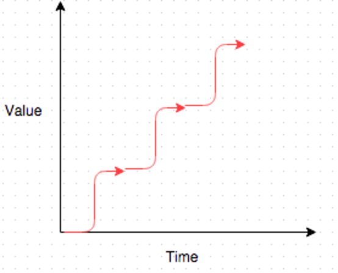

# 第六部分 流程

在各关键职能安排好了关键人员之后，公司有效运作，数据系统正常运行，经理和团队成员之间的双向信息交流顺畅。现在，剩下的就是你与外部世界的交流，包括与投资者、招聘者和客户的互动。这些流程 —— 筹集资金（简称筹资）、招聘和销售 —— 都是相同的流程，它们只在交流的内容上有所不同。

在筹资过程中，你将公司的股权和债务作为高质量的投资进行销售，而投资者则以资本作为回报。在招聘中，你将公司作为高质量的就业机会进行销售，而新员工则以时间和精力作为回报。在销售中，你将产品作为高质量的解决方案进行销售，而客户则以金钱作为回报。

以上任意一种情况，当一个人做决策时，他在用金钱或时间来投资你或你的公司。因此，你需要与这些决策者建立信任关系，以便进行筹资、招聘或销售。

Segment的Peter Reinhardt正确指出：

> 这也是一个将大量复杂的利益相关者协同合作以实现某件事的过程。

## 第27章 筹集资金

### 由你挑选合作伙伴，而非公司
公司筹集资金需要找投资人。在选择投资人时，应确保（至少你认为）他能为公司增值，是愿意与你合作的伙伴。合作伙伴的人选应由你来决定，而不是让公司来决定。怎样选择呢？先向其他公司的创始人了解投资人的口碑，让他们列举出与他们合作较好的投资人名单。筛选出那些愿意长期合作的投资人，与他们联系。

### 引荐
引荐是筹资过程中最关键的环节，而且只有一次机会。我建议使用三角定位法。

当想与一位投资人建立联系时，首先在你的社交网络中找到三五个与他相识的人。请他们给目标投资人发送一封电子邮件，告诉对方他们认为你很出色，并强烈建议他与你会面。在收到多封这样的电子邮件后，投资人将主动与你联系。他以前肯定收到过推荐，但从未收到过同一个人的三次或更多推荐。他得出结论，你和你的公司一定非常出色，因此与你会面之前就已经倾向于投资你了。

在短时间（一周内）内发出所有的推荐。与公共关系一样（第30章），让推荐产生共振并达到临界点，此时推荐的声音会压过噪声。密集的推荐可让共振的效果达到最佳。

有一点要注意：不要把相同的潜在推荐脚本交给每位引荐者转发。如果投资人收到多份相同的内容，他会认为推荐行为是由你策划的。因此，要么给你的引荐者不同的建议内容，要么不给建议。

### 两种方法
有两种筹资方法：传统方法（Traditional Method）和关系方法（Relationship Method）。

传统方法是向投资公司推销你的故事，通常是通过幻灯片展示客户问题、你的解决方案、市场规模、单元经济、财务预测、竞争对手、团队成员、牵引力、营销策略等。不出意外的话，你可能会碰壁多次才会和找到与你产生火花的投资人。

关系法是在讨论你的公司做什么之前，与投资人建立信任和友好关系。这需要更多的时间，但它会极大地提高交易成功率。这是因为无论我们看起来多么理性，我们通常是由我们的情感反应引导的。我们做出本能的、凭直觉的选择，而我们的理性大脑很擅长在这些选择上加上逻辑。
 
第一次谈论你的公司时，投资人将对是否想要投资做出决定。如果他还不喜欢或信任你，那么你的公司最好看起来完美无缺，然而事实往往并非如此。因此，关键是等到确定投资人在个人层面上喜欢和信任你后再谈论你的公司。到那时，投资人将对你有积极的偏见，并倾向于投资你的公司，瑕疵多也无妨。

那么，怎样让投资人喜欢和信任你呢？

### 建立信任和好感
想想你喜欢的人。你喜欢那些只谈论自己，对你和你的生活毫无兴趣或好奇心的人吗？还是你喜欢那些询问你，聆听专注，并对你的内心生活真正感兴趣的人呢？

第一次与潜在投资人见面时，询问他们关于自身的事情，让他们感受到，你真正对他们的工作和生活感到好奇，问他们很多问题。对他说：“刚才你说过……”，然后回顾一下他们对你说的要点，向他们证明你正在倾听。会面结束后，尽可能记下你对这个人的所有信息。

在与他们的下次会面时，说：“上次我们谈论的时候，你说过……”然后再次重复要点。当我们发现有人足够关心我们生活的细节时，这是一件令人温暖的事情。

此外，告诉他们，他们做的哪些事情让你很感激。即使没有，你仍旧可以感激他们花时间与你会面。

问题在于，在没有明确目的谈论你的公司的前提下，怎样才能获得首次会面的机会呢？您可以使用上文概述的三角定位法，但如果没有足够的共同熟人，您可以直接要求。明确表示你意图建立关系。说一些类似：“我们只想与我们有良好关系的投资者合作。所以让我们从喝咖啡开始，互相了解一下。”的话。

第一次会面结束时，与投资人约下次会面的时间。由于目的很明确，旨在建立关系，投资人很可能会答应。如果在这次会议中，你让他们尽情分享自己的事情，他们会很享受这次会面，并期待着下一次。

这些会面不需要很长时间，也不需要面对面沟通。与一个人通话15分钟与一小时的用餐一样有效，你应展现出对他们真正的关心和对他们生活细节的记忆。经过两次这样的会面，当你倾听他们并反映他们的话时，他们会信任和喜欢你。再多一些，他们就会爱上你。当他们喜欢并信任你时，你是能感觉得到的。他们很可能在言语上告知对你的喜爱。如果没有，你也能从他们的肢体语言感受到。

然后，你可以有信心地谈论你的公司，因为他们已经倾于向你投资。如果你不擅长理解肢体语言，只需等待。在某个时候，他们会说出这样的话（这是一位投资人的实际引用）：“我真的很喜欢你，我想投资你的公司，现在告诉我一些你的公司的情况吧。”

总结一下，这四个关键点是：
1.  询问他们关于他们的生活。
2.  对它说“你提到……”，以此证明你已经听到。
3.  通过在下一次会面时说“上次我们谈论的时候，你说…”证明你记得。
4.  让他们知道你欣赏他们的哪些方面。

如果做到这四点，你将建立起一种联系，然后就有了一位愿意投资的投资人。

当大多数CEO第一次听到这种方法时，他们会有强烈的反感情绪。这种方法感觉不自然，与他们迅速达成交易的本能相悖。但当他们尝试过这种方法后，发现它非常有效，他们就会转变成狂热的支持者。因此，我的最佳建议是先在几位潜在投资者身上尝试，看看它是否比传统方法更有效。

### 强化关系
一旦你与一个人见过几次面后，如果向他展示了你对他的生活的记忆和关心，你就建立了一种关系。这很可能足以让他们喜欢你。但为什么要满足于刚刚够呢？为了进一步强化关系，继续对他们感到好奇，并向他们展示你记得他们说过的事情。进行三到五轮的接触将巩固这种关系。不是每一轮的接触都需要是面对面的会谈 —— 比较极端的情况，发送一条简单的消息足矣。

以下是来自全球最成功投资公司之一的一位合伙人的感谢消息示例：

> *你好 Matt*
> 
> *只是想表达感谢之情。我真的很喜欢我们周二的交流以及之后的短暂沟通。也非常感谢你请我吃午餐。期望很快下次再聊！* 
> *Bill*

当收到这条感谢的消息时，我感到非常荣幸。

以下来自CoinList的创始首席执行官Andy Bromberg，他的行为更进了一步： 

> *冒着泄露我的秘诀的风险，我建议手写感谢便条。当我收到手写便条时感觉不可思议。相信其他人也会感到非常惊讶的，而且通常会记住你是“那个写手写便条的人”。*
 
因此，养成定期审视你的联系人列表并发送感谢消息的习惯。你将会对其带来的巨大善意感到震惊。Andy建议将这视为一个正式的流程。他说：
> 每天我都会回顾我的所有互动，并根据需要发送（或计划）感谢的消息。这确保我不会漏掉任何人，并保证及时。而且这实际上只需要几分钟。

### 销售自己，而不是公司
Speechify的CEO，Cliff Weitzman提到，重点在于销售自己而不是公司。当他对投资人做到这一点时，他就收获了一位终身投资人 —— 当他的公司转型或创建新的公司时，投资人将跟随投资他。因此，当Cliff意识到信任和好感已经建立时，他分享了他的人生故事 —— 使用他的兄弟Tyler发现的一种方法。

BlackSMS的首席执行官Tyler Weitzman喜欢研究社交情境。作为斯坦福大学的本科生，他研究了一种在保持谦逊和易于亲近的同时传达个人成就的方法（或者如果你愿意，可以称之为“吹嘘”）。通过对许多讲故事的高手进行无数次采访，Tyler确定了以谦卑的方式讲述个人故事的最终结构： 

  - 贡献：“如果没有\[其他参与者的名字\]的参与，这不可能成功。
  - 辛勤工作：“为此我们不得不付出很多努力，例如\[描述辛勤工作\]。”
  - 脆弱性：“对我来说，最困难的时候是…”
  - 责任：“我们被我们的梦想驱使着，要\[高尚的动机\]。”
  - 感激：“我为……而感到自豪和感激。”

我鼓励你使用以上结构向朋友讲述你的故事，看看会发生什么。询问朋友的反应，相信你会感到惊讶的！

有关此方法的样例，请参考本书末尾的致谢部分。

### 时机
创业公司在生命周期中有一些里程碑，一旦达到，就会极大提升公司走向成功的可能性。这些里程碑或拐点大大降低了公司的风险，并使筹资变得更加容易。在公司的成长过程中，其价值并非呈线性增长，而是呈现出阶梯状的模式，如图所示。

以下列举了创业公司在发展过程中的几个关键拐点。

  - 组建一支卓越的工程团队： 一支强大而高效的工程团队是公司成功的基石，这标志着公司在技术方面的实力和竞争力。
  - 吸引首批3个付费客户： 签署首批付费客户，这意味着你的产品或服务被市场接受，有人愿意为之付费。
  - 年度经常性收入（ARR）超过100万美元： 超过100万美元的ARR表明你已经实现了产品市场契合，你的产品或服务满足市场需求并具有可持续的商业模式。
  - 组建一支精干的销售团队： 一支高效的销售团队是推动收入增长的关键，他们负责将产品引入市场并促使客户采取行动购买你的产品或服务。
  - 年度经常性收入（ARR）超过500万美元： 超过500万美元的ARR表明公司的销售团队非常有效，能够推动更高规模的业务。
  - 聘请所有部门的高级管理人员： 拥有一支全面的高级管理团队意味着公司已经发展成熟，能够在各个方面有效运营。高级管理人员的聘请通常包括财务、市场营销、人力资源等领域的专业人才。

这些拐点标志着公司从一个阶段过渡到另一个阶段，对于吸引投资、提高公司估值和促进业务增长都是至关重要的。在创业旅程中，创始人应该密切关注并努力实现这些关键的里程碑。

### 未来股权简单协议与定价股权
当无法创建定价股权轮时，或者因为筹集的金额较小，或者没有机构投资者引领定价股权轮时，SAFE（Simple Agreements for Future Equity，未来股权简单协议）和可转换票据（Convertible Note）是很好的投资工具。定价股权轮常常涉及大量法律费用，有时超过100,000美元，而这通常由公司支付。SAFE和票据更为经济实惠，法律费用通常不到10,000美元。因此，建议仅在筹集的总资金超过2百万美元，最好超过5百万美元时才进行定价股权轮。

SAFE通常以比下一轮定价股权轮更低的价格进行转换，并且可能还包含一个估值上限。我建议即使在进行定价股权轮后，也应该保留一个SAFE。以下是这种情况的一个例子：
  - 当创办公司时，你可能会通过SAFE筹集初始资金2 ~ 5百万美元。
  - 当公司达到产品市场契合时，你可能会通过 A轮定价轮额外筹集2 ~ 10百万美元，而SAFE会转换为这一轮回。
  - 然后，你可以立即提供另一个SAFE。继续保持其开放状态，直到你再次筹集5 ~ 10百万美元。
  - 一旦公司的年度经常性收入达到500万美元，你可能会通过B轮定价额外筹集5 ~ 20百万美元，而第二个SAFE会转换为这一轮回。
  - 然后，你可以提供第三个SAFE轮回，以此类推。

机构投资人通常更喜欢参与定价股权轮回。但是，家族办公室①，甚至战略投资者，通常在公司发展成熟时也很愿意参与SAFE，只要他们确信会有另一轮定价股权轮回。因此，在SAFE中始终筹集轮回的第一笔资金几乎没有什么不利之处。这笔资金有助于延长公司的资金筹集期限，以达到下一轮定价股权轮回所需的指标。

### 定价轮回
在某个时刻，你将需要将SAFE转换为正式的定价轮回。这通常发生在A轮阶段，但有时也会在种子轮阶段发生。由于涉及到定制条款和谈判，这可能是一个耗时和昂贵的过程。

情况往往是，创始人收到一堆设定了时间表的条款书。接下来，他们匆忙走流程，最终还没来得及了解长期后果就签署了条款。

在这个流程上应该多花些时间，并尽力避免任何错误，否则之前节省的时间和精力将在以后加倍偿还！一旦签署条款，这个过程就不可逆转。在签署之前，务必花时间与你的律师逐条审查每一款条款，以充分理解它们。

投资人相对你有巨大的信息优势。他们经常签署这些条款单，他们是作为少数股东控制公司的专家。他们常常使用的工具隐藏在“特殊条款”中。你可能认为这些条款在签署时是无害的，但它们可能在你最不期望的时候（比如在出售公司时）被激活。

不要依赖你的律师找出这些“可疑”的条款。他们大概率会认为这是标准条款，但情况往往并非如此。将你的条款单（如有必要，请先清洗数据，对敏感数据脱敏）交给其他你信任的创始人和投资人以获取反馈。如果发现了不道德的条款，请将该投资人列入黑名单。

### 法律费用
在进行定价轮回时，你需要一家知名律师事务所提服务。他们将非常乐意提供帮助，这是他们收取大额费用的最爱之一。需要技巧管理成本和时间，如果直接按照他们的方式计费，最终结果很容易超过10万美元，尤其是对于A轮投资而言。然而，如果你采取积极的管理方式，可以将账单降至15,000美元以下。这很重要，当账单超过一定金额（通常为25,000美元）时，公司通常需要为他们自己的律师以及投资人的律师支付费用。

典型的投资过程如下：
1.  律师相互致电讨论条款，意见不一致。
2.  公司律师致电公司决策者寻求指导。（每封电子邮件或留言，律师最少按15分钟计费，通常为1小时。）
3.  公司决策者回应公司律师。（再计费1小时。）
4.  公司律师联系投资者律师。（再计费1 ~ 2小时。）
5.  投资人律师然后联系投资人决策者就同一问题进行沟通。（再计费1 ~ 2小时。）
6.  投资人律师回应决策者律师。（再计费1 ~ 2小时。）
7.  这种来回不断继续，计费小时不断增加，直到达成所有细节的一致。整个过程需要45 ~ 60天才能得到最终文件，法律账单通常双方都超过10万美元。

但还有另一种方式。它可以在不到1周的时间内产生最终文件，每方的法律账单不到15,000美元。

投资人必须用他们的管理费用支付法律费用。这笔收入本来会进入他们个人的口袋，所以投资人不喜欢支付法律费用（甚至是他们自己的），他们更愿意给公司更多的钱（这是从基金的投资资本中提取出来的），并让公司支付投资人的律师费。只要求投资人在执行他们的律师的行为规则方面支持你，你可以为投资人提供这种方便。这些规则是：

1.   一旦投资的基本条款达成一致（在条款单中），然后安排一个4 ~ 8小时的会议（或电话）。会议可能只持续2 ~ 3小时，但要预留足够的时间，确保它在必要时可以延长。）参加者包括： 
    - 公司的决策者  
    - 领投投资人的决策人  
    - 公司的律师  
    - 领投投资人的律师  
    如果这4个人中的任何一个无法参加会议（或电话），就得重新安排会议。
2.  一方的律师准备投资文件的初稿，另一方的律师在会议/电话之前以书面形式发表评论。律师之间没有其他联系。
3.  在会议上，每个人从头到尾逐段审视文件，并解决所有书面评论。律师不允许发言，除非在审查的段落上向他们的客户提供建议。谈判是在公司（CEO）的决策者和领投投资人（投资人）之间进行的。决策者逐个处理每个要点，直到他们在所有要点上达成一致。每达成一项协议，律师们根据刚刚达成的业务协议，实时把它转换成法律意义上的文字。
4.  撰写基础文件的律师起草最终文稿。另一方的律师确认文稿正是他们在电话中达成一致的，之后文稿确定为最终版。 
    在这个过程中，公司律师的账单不得超过：
    - 4小时 写基础文件
    - 1小时 在重要会议前读评论
    - 8小时 参加重要会议
    - 4小时 撰写最终文稿 
    总共17小时，每小时800美元 = 13,600美元。 
    在这个过程中，投资人律师的账单不得超过：
    - 4小时 对基础文件发表评论
    - 8小时 参加重要会议
    - 2小时 阅读最终语言 
    总共14小时，每小时800美元 = 11,200美元。

### 表决权股份
Mark Zuckerberg只拥有Facebook的少数股份，但仍然保持对其的总体控制。是如何做到的呢？因为他拥有的股份附带额外的投票权。现在，投资者已经接受了这种[结构](http://www.slate.com/articles/business/moneybox/2012/02/facebook_s_ipo_how_mark_zuckerberg_plans_to_retain_dictatorial_control_his_company_.html)，没有理由不在自己的公司中建立类似的结构。而且最容易做到的时间点是在有股权投资者之前。请律师在资本表（SAFE是可以的）上添加股东股份（Founders Shares）。

### 创始人友好股份
此外，[创始人友好（FF）股份](https://www.capshare.com/blog/what-is-founderfriendly-stock-and-should-i-use-it-in-my-startup/)允许创始人在每一轮定价之后获得流动性，而不会提高授予其他团队成员的期权的公允市场估值。这使得创始人可以继续支付较低的薪水（在公司内看起来不错），但仍然能够获得足够的流动性，而不用担心陷入对公司的长期承诺中。同样，在有股权投资人之前，应创建这些股份。

### Carta
管理股权证书对投资者和公司都很痛苦。通过使用Carta（前身为eShares）等电子系统，甚至只是从第一天开始使用简单的电子表格，可以避免麻烦。这比支付律师事务所的法务助理每小时300美元来回答投资者对他们所有权的每个问题要便宜得多。Carta为投资者提供对这些信息的即时访问，而投资者可能已经在Carta上拥有他们大部分的投资组合。附带的409a估值服务的费用约为其他独立的409a服务收费的四分之一。

### 409a估值
你将需要对普通股进行估值，以确定你发行的任何期权的正确行权价格。这是一种409a（IRS法典）估值，并且必须在发行期权之前完成。你需要每年或者在公司价值发生变化时（新融资，重大客户增加等）更新此409a估值。

### 期权池
在筹集定价股权轮回时需注意，投资人希望看到足够的未发行期权（期权池），以便在股权投资之后仍有10 ~ 20% 的未分配期权池。这个事实经常让创始人感到惊讶。当风险投资公司以2000万美元的后期估值提出400万美元的投资时，创始人认为他们被稀释了20%。但是，这个同样的要约几乎总是要求在股权进入之前创建一个大的期权池。因此，这个后期期权池加上新的股权实际上代表了对现有股东的40% 稀释。关于这一点你能做的不多，但有必要了解。

 

___

①  译者注：为富裕家族管理财富的私人机构。
