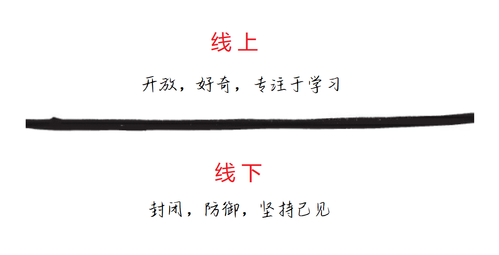

## 附录A：《有意识的领导力》摘要

> 作者：Alex MacCaw，Clearbit公司创始人兼CEO

[有意识的领导力](https://conscious.is/)的核心内容是：在处理事情时，相对于把事情做正确，更在意从做事情的过程中学到知识。如果一个人畏惧出错，那么这种畏惧心理会驱使他不惜一切代价捍卫自己的观点，过度努力地说服别人，通常还带着情绪。

当负面情绪（恐惧、愤怒、悲伤）影响到思考时，有意识的领导力可以帮助我们释放情绪，将其转变到好奇心状态  。在此状态下，我们对所有的想法和创意都持开放态度，即使我们对这些观点持反对意见。

在充满好奇心状态下处理事情时，真正的、优雅的解决方案会得以实施。

以下是来自《有意识领导力的15项承诺：可持续成功的新模式》一书的摘要。

### 从线上领导

任何时候，领导者都处于线上或线下状态。如果你在线上，你在有意识地领导团队；如果在线下，那就不是。处于线上时，一个人是开放的、好奇的，专注于学习；而在线下时，他是封闭的、防御性的，专注于坚持己见。

很多人从线下领导 —— 这是人类源于数百万年演变的一种普遍状态。一旦我们感觉到冲突的迹象时，我们的脑袋就会炸开，恐惧和愤怒涌上心头，我们变得防御性，并坚持认为自己是对的。此时，我们处于线下状态。

相对于正处在线下状态，知道自己处于线下状态更重要。有意识领导力的第一个标志是自我意识和对真理的追求。第二个标志是暂停、稍息，然后自己转变为一种开放和好奇的状态，并上升到线上。

### 有意识的原则
以下是将自己置于线上状态的一些原则。

#### 承担全部责任
>  我承诺对我的生活环境以及对我的身体、情感、心智和精神健康负全责。我承诺支持他人对他们的生活负全责。

对自己的环境（身体、情感、心理和精神）承担全部责任是真正个人和关系转变的基础。责备、羞耻和内疚都来源于有毒的恐惧。有毒的恐惧推动了受害者——恶人——英雄三角关系，使领导者和团队处于线下状态。

有意识的领导和团队承担全部责任——即放弃责备，将我们生活的原因和控制权回归到我们自己身上，而不是外部事件中。

有意识的领导者不会问“责任人是谁？”取而代之，他会这样问：“我们能从中学到什么？我们怎样能够从中成长？”有意识的领导者对这样一种可能性持开放态度：与其控制和改变世界，也许世界就是现在这样正好。这为个人和组织层面的巨大增长机会创造了可能性。

### 通过好奇心学习
> 我承诺增长自我意识。我承诺将每次互动视为学习的机会。我承诺好奇心是一种迅速学习的途径。

自我意识和学习敏捷性被认为是领导者持续成功的基础——它们构成有意识领导力的基础。

有意识的领导者充满激情地致力于了解自己，这是他们愿意保持好奇心状态的基础。在任何时候，领导者要么在线上（开放、好奇，努力学习），要么在下线（防御、封闭，坚持己见）。

“正确”并不会引起悲剧，但渴望“正确”、证明“正确”和为了“正确”而战斗都可能引起悲剧。即使有意识的领导者像其他人一样有防御性，他们经常通过稍息、呼吸、接受和转变来中断这种自然的反应。

#### 感受到所有的情感
> 我承诺我将彻底感受我的情况。它们出现，我将它们定位在我的身体中，然后移动、呼吸和发声，使它们完全释放。

优秀的领导者学会访问三个智能中心：头部、心脏和肠道。

在大多数组织中，抵制和压抑感情是标准操作程序。负面的感情是决策和领导的干扰。

有意识的领导者知道感情是自然的，表达它们是健康的。他们知道情绪是运动中的能量；感觉只是身体上的感受。

主要的四种情感是愤怒、恐惧、悲伤、喜悦。知道如何将它们完全表达直至完成有助于我们提高自己的情商。每种主要的情感在身体内或身体上都有独特的能量模式和感觉。压抑、否认或循环使用情感会导致身体、心理和关系上的问题。

要释放情感，首先定位身体中的感受，然后发声表达感受。

有意识的领导者学会定位、表达和释放他们的感受。他们知道情感不仅把生活变得丰富多彩，同时也是成功领导必不可少的朋友。

### 坦诚直言
> 我承诺我说出来的是真话。我承诺成为一个其他人口中的真诚表达自己的人。

领导者和团队发现，清晰地看到现实对于成功至关重要。为了清晰地看到现实，领导者和组织需要每个人都说实话，不撒谎，也不隐瞒真相。他们需要坦诚直言。坦诚直言是以诚实、开放和警觉的方式展示所有想法、感受和行为。

坦诚直言增加了领导者和团队更清晰看到真实世界的可能性。隐瞒是指在相关方披露事情时，只告知部分或完全不告知。隐瞒也会减少领导者的能量，这通常表现为他们的无聊或倦怠以及团队的关系破裂。

与其隐瞒，有意识的领导者实践揭示真相。他们揭示不是因为他们是对的，而是因为他们希望被了解。通过这种透明性，他们建立连接并展开学习。有意识的倾听是有效领导中最重要的技能之一：通过确定我们的听觉“滤镜”，我们可以放下它们，全神贯注地倾听对方的表达。

有意识的倾听需要勇气：我们必须听取对方通过言辞（头脑中心）、情感（心脏中心）和基本愿望（肠道中心）所表达的内容。当你与对方有共同的使命，你们都有必要的表达技巧（包括毫无顾忌地表达自己）的时候，这是你与对方开启一段坦诚关系的最好开始。

### 消除流言蜚语
> 我承诺制止流言蜚语，直接与我有顾虑的人交谈，并鼓励其他人直接与他们有不畅或顾虑的人交谈。

尽管流言蜚语长期以来一直是办公室文化的一部分，但它是一个不健康组织的关键指标，也是阻碍动力和创造力的最快方式之一。

流言蜚语是一个人对另一个人有负面意图的陈述。换句话说，如果那个人在旁边，说话的人将不会以这种方式分享的陈述。

流言蜚语是企图验证一个人思维的正确性，它是处于线下的；它不是一种旨在为讨论的人服务的评论。

人传播流言蜚语是为了获取验证，控制他人和结果，避免冲突，获得关注，感觉包容，并通过否定别人使自己变得正确。简而言之，人通常是因为恐惧而传播流言蜚语的。如果你传播过流言蜚语，想消除它也很容易，告知相关的人你传播过即可。

当领导者和团队学会彼此坦率地交流时，他们受益于关于组织内部问题的直接反馈，否则可能会破坏创造性能量和有效协作。

### 正直
> 我承诺我的行为是正直的，包括承认所有真实的感受，表达无可辩驳的真相，遵守我的承诺，并承担100% 的责任。

完整性是遵守约定、承担责任、表达真实感受和表达无可争议的真相的实践。对于处在上升期的领导者和组织而言，这是至关重要的。

有意识的领导者在制定约定时确保它无可争议的。他们制定明确的约定，遵守它们，需要时进行重新协商，并在破裂时进行清理。完整性对于有意识的领导和成功的组织至关重要。

### 产生感激之情
> 我承诺生活在感激中，完全敞开心扉接受和给予感激。

承诺感激，以及避免权利主义，有助于领导者和组织在工作场所增加价值和联系。

感激由两部分组成：敏感的意识和价值的增加。

当奖励和利益变成期望而不是偏好时，就会出现权利主义。生活在感激之中有两个方面：敞开完全接受感激，并能够完全给予感激。对于大多数人来说，接受感激比给予感激更难，人们更害怕接受感激。为了避免接受感激，人们有策略地转移它。完美的感激是真诚、无可争议、具体和简洁的。

感激可以让社区中独特的礼物得到认可。

### 过着充满游戏和休息的生活
> 我承诺创造一个充满游戏、即兴和笑声的生活。我承诺让生活的一切都在轻松自如地展开。我承诺通过尊重休息、恢复和规律来最大化我的能量。

创造一个充满游戏、即兴和笑声的生活可以让更加生活轻松展开，确保能量最大化。游戏是一种吸引人、表面上毫无目的的活动，提供消遣。玩游戏时，人会很大程度放松自己。当沉浸于游戏中时，人的我意识消失，感觉时间都暂停了。

它也是自我激励的，让你想再做一次。强加的努力工作文化将导致更高水平的压力、负罪感、员工倦怠和离职率。通过这种“努力工作”的方式用力出力的能量是充满了努力和奋斗。

大多数领导者抵制游戏，因为他们认为如果他们不认真努力工作，他们会掉队。采取休息和游戏的组织实际上更加高效和富有创造力。当尊重休息、恢复和个人的生活节奏时，能量最大化。

一个有意识的领导者如果对自己、对组织珍视并鼓励游戏和欢乐氛围，他往往能创造出高效、更有成就的企业文化。

### 探索事物的反面
> 我承诺看到事物的反面，或比表面更真实的那一面。我意识到我解释周围的世界，并让其变得有意义。

有意识的领导者通过简单的方式来质疑导致痛苦的信仰，从“这是真的吗？”和“我能相信它绝对是真的吗？”开始。扭转练习让领导者练习将他们的信仰从知道转变为好奇。当有意识的领导者放下他们信仰的正确性时，他们向好奇心敞开，并与他们最深的欲望对齐。
